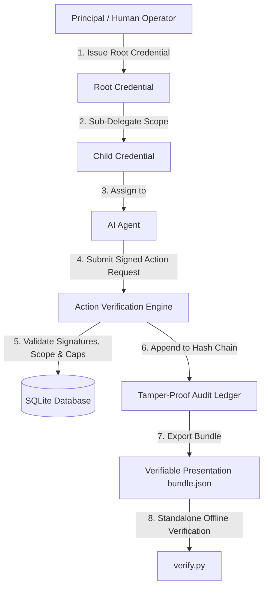

# Delegate — AI Agent Authorization Service

**Delegate** is a security framework and authorization engine for AI agents. It provides cryptographic delegation, scope-restricted credentials, real-time action verification, cascading revocations, and tamper-proof audit ledgers.

---

## 🌟 Key Features

* **🔐 Cryptographic Delegations (Ed25519)**
  Uses Ed25519 digital signatures over canonicalized JSON payloads to ensure non-repudiable issuance and signature verification.
* **🛡️ Hierarchical Scope Sub-Delegation**
  Enables principals to issue root credentials to agents, who can sub-delegate scoped credentials. Sub-delegation bounds (action types, categories, spend limits, validity periods) are strictly enforced to be mathematical subsets of the parent credential.
* **⚡ Real-Time 10-Step Verification Engine**
  Evaluates every action request against signature validity, credential activation, time windows, action/category limits, per-action spend caps, cumulative spend caps, replay protection (unique action IDs), and delegation chain status.
* **🔄 Cascading Revocation Cascade**
  Revoking any parent credential instantly invalidates all downstream child credentials across the entire delegation hierarchy.
* **🔗 Hash-Chained Audit Ledger**
  Every action evaluation (approved or rejected) is recorded into an append-only audit ledger where each entry contains a SHA-256 hash chaining to the previous record (`prev_hash`). The full audit chain integrity can be verified on demand (`GET /audit`).
* **📴 Offline Standalone Verifier**
  Includes a zero-dependency script (`verify.py`) to cryptographically verify Verifiable Presentation bundles offline without a server, database, or network connection.
* **💻 Modern Enterprise Web Dashboard**
  Built-in Web UI served directly from FastAPI (`http://127.0.0.1:8000`) for managing principals, agents, credentials, actions, audit records, and offline bundle exports.

---

## 🏗️ Architecture Overview



---

## 🛠️ Technology Stack

| Layer | Technology |
| :--- | :--- |
| **Framework** | [FastAPI](https://fastapi.tiangolo.com/) + [Uvicorn](https://www.uvicorn.org/) |
| **Database & ORM** | [SQLAlchemy 2.0](https://www.sqlalchemy.org/) (SQLite) |
| **Cryptography** | [Cryptography](https://cryptography.io/) (Ed25519, SHA-256) |
| **Validation** | [Pydantic v2](https://docs.pydantic.dev/) |
| **Frontend** | Vanilla HTML5 / CSS3 / ES6 Javascript |
| **Testing** | [Pytest](https://docs.pytest.org/) + HTTPX |

---

## 🚀 Quickstart Guide

### 1. Installation

Clone the repository and install the dependencies:

```bash
git clone https://github.com/shubhkapoor0904/delegate.git
cd delegate
pip install -r requirements.txt
```

### 2. Run the Server

Launch the FastAPI application:

```bash
uvicorn app.main:app --reload --port 8000
```

The application will start on `http://127.0.0.1:8000`.

* **Web UI Dashboard**: `http://127.0.0.1:8000/`
* **Interactive API Documentation (Swagger)**: `http://127.0.0.1:8000/docs`

---

## 🧪 Running Demos & Test Suite

### 1. End-to-End CLI Demo

Execute the step-by-step end-to-end demonstration script:

```bash
python demo.py
```

The demo executes 9 sequential steps:
1. Registers Principal (`priya`) and Agent (`procurement-intake-agent-v1`).
2. Issues a root credential (`cred-root-001`).
3. Submits an approved action ($3,200 SaaS renewal).
4. Submits an over-limit action ($6,000) and receives a rejection.
5. Revokes root credential `cred-root-001`.
6. Submits an action against the revoked credential and receives a rejection.
7. Fetches and validates the hash-chained audit ledger.
8. Exports an approved action bundle to `bundle.json`.
9. Executes `verify.py` in a separate process to verify the presentation bundle offline.

### 2. Standalone Presentation Verifier

Verify any exported `bundle.json` completely offline:

```bash
python verify.py bundle.json
```

### 3. Run Pytest Suite

Run all automated unit & integration tests:

```bash
pytest
```

---

## 🔌 API Reference Summary

### Principals & Agents
* `POST /principals` — Register a principal (returns ID & public key)
* `GET /principals` — List all registered principals
* `POST /agents` — Register an AI agent (returns ID & public key)
* `GET /agents` — List all registered agents

### Credentials
* `POST /credentials` — Issue a new root or sub-delegated credential
* `GET /credentials` — List all credentials
* `GET /credentials/{credential_id}` — Get specific credential details
* `POST /credentials/{credential_id}/revoke` — Revoke credential and cascade to descendants

### Actions & Audit
* `POST /actions` — Submit an agent action request for real-time verification
* `GET /audit` — Retrieve complete audit ledger and verify hash-chain integrity (`chain_valid`)

---

## 🔒 Security & Key Management

* **Private Key Security**: Private keys are generated server-side and kept in memory for signing operations (`IN_MEMORY_KEY_STORE`). Private keys are **never** written to database tables or exposed in API responses / Web UI.
* **Deterministic Serialization**: All payloads are canonicalized (`json.dumps(obj, sort_keys=True, separators=(',', ':'))`) before Ed25519 signing and verification to prevent whitespace/key-ordering attack vectors.
* **Replay Protection**: Each action request must contain a unique `id`. Re-submitting an already processed `action_id` is rejected.
